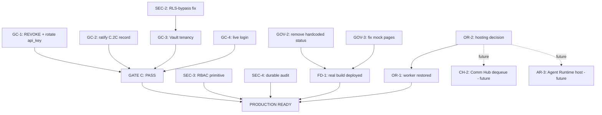

# BELL24H_OS REMEDIATION MASTER PLAN

**Repository:** `digitex-erp/digitex-erp-bell24h-os` (`HEAD = bd31707`)
**Phase:** Gap Closure Planning Sprint — **planning and architecture only**
**Date:** 2026-09-14
**Source of record:** `docs/project/BELL24H_OS_PRODUCTION_READINESS_REPORT.md`, exclusively —
per mission instruction, no new codebase investigation was performed to produce this
document; every blocker below is extracted from that report's own sections (cited inline).
No code was written, no file was modified, no commit was made, nothing was installed,
nothing was built.

**Scope framing, stated explicitly (an interpretive choice this plan makes, not something
the source report or the mission dictates outright):** "the minimum path to PRODUCTION
READY" in this document means the **baseline system** the Production Readiness Report
scored and classified — the API layer, the frontend deployment, security, and governance.
It does **not** mean building Communication Hub or Agent Runtime to completion — the
mission explicitly forbids implementing either, and the source report's own Section 12
already recommended closing Gate C *before* either of those tracks starts. Communication
Hub and Agent Runtime therefore appear below as their own blocker groups (as the mission's
Objective 2 requires) and as their own dependency nodes, but sit **outside** the critical
path to PRODUCTION READY (Section 3) and outside Phases 1–3 (Sections 4–6) — they become
Phase 4+ work, after this plan's scope ends, and only once the foundation they both depend
on (Section 2) exists.

---

## 1. Production Blockers

Every blocker below is extracted from `BELL24H_OS_PRODUCTION_READINESS_REPORT.md`, grouped
per Objective 2. Each row cites the section of that report it comes from.

### 1a. Gate C

| ID | Blocker | Report section | Who must act |
|---|---|---|---|
| GC-1 | `ai_providers.api_key` not `REVOKE`d from `anon`/`authenticated`; no key-rotation evidence | §8, §9 | Project owner (DB access) |
| GC-2 | No ratified Gate C closure-criteria record exists anywhere in the repo | §8 | Project owner / Council (governance sign-off) |
| GC-3 | Knowledge Vault tenancy — 5 tables with no `organization_id`, RLS `USING (true)`, pooled connection bypasses RLS regardless | §8 | Council (decision) + Engineering (implementation) |
| GC-4 | No evidence any real user has ever completed login | §8 | Project owner (one live login attempt) |

### 1b. Frontend Deployment

| ID | Blocker | Report section |
|---|---|---|
| FD-1 | `vercel.json`'s `buildCommand` never runs the real `vite build` — production serves a static placeholder, not the app. All 24 SPA pages have never been live. | §6c, §10 |
| FD-2 | No documented decision exists on whether this deployment is *intended* to be API-only, or whether the SPA should be shipped | §11A.1 |
| FD-3 | Two pages are pure fabricated mockups (Settings, Admin) — would be user-visible immediately if FD-1 were fixed without first addressing §1e below | §5 |

### 1c. Communication Hub

*(Listed per Objective 2's grouping requirement. Per this plan's scope framing above,
these are dependency-graph nodes for a future track, not part of the Phase 1–3 critical
path.)*

| ID | Blocker | Report section |
|---|---|---|
| CH-1 | Communication Hub, Provider Registry, WhatsApp/SMS/Email adapters, Notification Infrastructure — confirmed absent, zero code of any kind | §6b |
| CH-2 | No hosting/dequeue mechanism exists for any future send/retry queue | §11B (references the separate Communication Hub implementation plan) |
| CH-3 | Platform-level credential storage design needed that does not repeat the `ai_providers.api_key` mistake | §11B |

### 1d. Agent Runtime

*(Same scope note as 1c — dependency-graph nodes only, not in the Phase 1–3 path.)*

| ID | Blocker | Report section |
|---|---|---|
| AR-1 | Server-side Agent Runtime confirmed absent; the only client-side artifact is an 8-line stub (`AgentService.ts`) that would need to be replaced outright | §6b, §11C |
| AR-2 | No policy/risk-classification layer exists anywhere in the repository | §11C |
| AR-3 | No real execution host — same underlying gap as CH-2 | §11C |

### 1e. Orchestration

| ID | Blocker | Report section |
|---|---|---|
| OR-1 | No process, client or server, has ever dequeued a job in production. `JobWorker` is the only queue-consumer that has ever existed, and it is disabled at its one call site (`src/main.tsx`). | §6a, §6c |
| OR-2 | The deployed runtime (Vercel serverless, `api/index.ts` → `server.ts`) has no persistent process — the structural reason OR-1 can't simply be "re-enabled" | §6c |
| OR-3 | Video Studio, Image Studio (and any other `job_queue`-dependent feature) have real UI and real data layers, but 0% of their advertised generation capability works because of OR-1/OR-2 | §3 (cross-referenced from the underlying product audit) |

### 1f. Security

| ID | Blocker | Report section |
|---|---|---|
| SEC-1 | `ai_providers.api_key` tenant-readable, no `REVOKE`, no rotation (same underlying fact as GC-1) | §9 |
| SEC-2 | 9 handlers (`/api/check-*`, `/api/vault/*`) use a pooled `DATABASE_URL` connection that bypasses RLS regardless of policy correctness | §9 |
| SEC-3 | No RBAC/`authorize()` primitive exists anywhere — every gated route is all-or-nothing: any authenticated user of any organization can call it | §9 |
| SEC-4 | No durable audit persistence — `server/audit.ts` is stdout-only | §9 |
| SEC-5 | No idempotency-key enforcement anywhere, despite being a stated rule in this repo's own architecture docs | §9 |
| SEC-6 | Rate limiting and AI budget counters are in-memory, per-process, and **unreliable in production today** specifically because production is Vercel serverless (cold starts reset the state; concurrent warm instances each hold their own copy) | §9 |

### 1g. Governance

| ID | Blocker | Report section |
|---|---|---|
| GOV-1 | Gate C itself is the primary governance blocker — see 1a | §1, §8 |
| GOV-2 | A hardcoded-fake-status pattern recurs in 3 independent files (Dashboard's "42 worker instances"/"AI Provider Status" cards, `AdminService.getSystemHealth()`, `DatabasePage`'s unconditional "Active" label) — violates this repo's own governance rule against hardcoded health/status results | §5, §9 |
| GOV-3 | Two pages present fabricated data as if real with no visual distinction from working features (Settings, Admin) — a user-trust/governance issue, not just an engineering gap | §5 |
| GOV-4 | One fully-working page (`IndustryDashboardPage.tsx`) is orphaned — not routed, unreachable — a hygiene/governance gap, not a functional one | §7 |

---

## 2. Dependency Analysis

### 2a. What blocks what (text form)

```
GC-1 (REVOKE + rotate api_key)         ─┐
GC-2 (ratify C.2C record)               ├─► GATE C CLOSURE ─► PRODUCTION READY
GC-3 (Vault tenancy decision+fix)       │        (mechanical constitution rule:
GC-4 (live login verification)         ─┘         one open item = BLOCKED)

SEC-2 (pooled-connection RLS bypass)  ──► GC-3 implementation depends on this being fixed
                                           for the "off-pool" half of the Vault tenancy fix
                                           to be real, not decorative

SEC-1 = GC-1 (same underlying fact, filed once, referenced twice)

SEC-3 (RBAC primitive)     ──► needed before: admin-gated routes can be real,
                                AR-1 (Agent Runtime tool grants), CH-3-adjacent
                                admin endpoints in a future Communication Hub

SEC-4 (durable audit)      ──► needed before: GOV-1's broader credibility,
                                AR-1 (agent actions need audit trail),
                                CH-1 (Communication Hub's audit layer, per its own plan)

OR-2 (no persistent process) ──► blocks OR-1 (worker restoration)
                              ──► blocks CH-2 (Communication Hub dequeue)
                              ──► blocks AR-3 (Agent Runtime execution host)
                              (ONE hosting decision, THREE dependents — see 2b)

FD-1 (real build)  ──► should not ship until:
                         GOV-2 (hardcoded status removed) AND
                         GOV-3/FD-3 (mock pages fixed or clearly marked)
                       — otherwise the fix "deploys" fabricated data to real users

GOV-2, GOV-3        ──► independent of Gate C; pure engineering fixes;
                         no external dependency, smallest-scope items in this whole plan

GOV-4 (orphaned page) ──► independent, cosmetic, no dependency either direction
```

### 2b. The single highest-leverage node

**OR-2 — the missing persistent-process/hosting decision — is the one blocker with the
most downstream dependents.** Fixing or deciding it once unblocks three otherwise-separate
tracks: Orchestration (OR-1, and therefore Video/Image Studio actually working), the
Communication Hub plan's own Phase 1 (CH-2), and Agent Runtime's execution host (AR-3).
This plan's Phase 3 (Section 6) treats it as a **decision**, not an implementation — per
mission scope, no worker is built here, only the hosting question is resolved so a later
sprint can build against a settled answer instead of three separate ad hoc guesses.

### 2c. Mermaid form (for a renderer that supports it; the text form in 2a is authoritative)



---

## 3. Critical Path

The shortest sequence of dependencies that reaches **PRODUCTION READY** (baseline, per the
scope framing above — not Communication Hub, not Agent Runtime):

1. **SEC-2** (stop new RLS-bypass reliance) → enables a *real*, not decorative, **GC-3**
   implementation.
2. **GC-1, GC-2, GC-3, GC-4** all resolved → **Gate C reaches PASS** (all four are
   required simultaneously per the constitution's own rule — there is no partial-credit
   path here).
3. In parallel with 1–2 (no dependency either direction): **GOV-2** (remove hardcoded
   status) and **GOV-3** (fix or clearly mark the two mock pages).
4. In parallel with 1–3: **SEC-3** (RBAC primitive) and **SEC-4** (durable audit) —
   both cross-cutting, neither blocks nor is blocked by Gate C directly, but both are
   named requirements in Section 7 below.
5. Once 3 is done: **FD-1** (ship the real build) becomes safe to execute — this is the
   step that actually puts any of the 24 SPA pages in front of a real user for the first
   time.
6. Once **OR-2** (hosting decision) is made: **OR-1** (a minimal, real dequeue mechanism
   for the existing `job_queue`) can be implemented, closing the Orchestration gap for
   already-built features (Video Studio, Image Studio, Content Planner) without building
   any Communication Hub or Agent Runtime capability.
7. **PRODUCTION READY** is reached when steps 1–6 are all complete — see Section 7 for
   the exact, checkable criteria.

**Everything in Sections 1c/1d (Communication Hub, Agent Runtime) is explicitly after
this critical path**, per the scope framing at the top of this document.

---

## 4. Phase 1 — Governance Unblock & Trust Repair

**Goal:** get Gate C's non-engineering items moving (they have the longest lead time
since they depend on a human outside this session), and fix the cheapest, highest-trust
issues immediately.

| Item | Type | Blocker(s) closed |
|---|---|---|
| Run the `REVOKE`/verification SQL already drafted in `GATE_C_CLOSURE_PACKAGE.md` Deliverable 4; rotate every previously-exposed key | Owner-executed | GC-1, SEC-1 |
| Perform one live login attempt, in incognito, against the current build; record the exact result | Owner-executed | GC-4 |
| Council decides Option A/B/C for Knowledge Vault tenancy (Option B — single-tenant, admin-only — already recommended in `GATE_C_CLOSURE_PACKAGE.md` Deliverable 2) | Council decision | Unblocks GC-3's implementation (Phase 2) |
| Ratify the C.2C closure record — the proposal already exists in `GATE_C_CLOSURE_PACKAGE.md` Deliverable 3; this phase is the sign-off, not new drafting | Owner/Council sign-off | GC-2 |
| Remove or replace the three hardcoded-fake-status locations (Dashboard's infra/AI cards, `AdminService.getSystemHealth()`, `DatabasePage`'s unconditional "Active" label) with either a real check or an explicit "not implemented" state | Engineering (smallest-scope fix in this plan) | GOV-2 |
| Decide the fate of Settings and Admin: wire them to real data/actions, or mark them unambiguously as non-functional/hide them from navigation until fixed | Engineering + Product decision | GOV-3, FD-3 |

**Phase 1 exit condition:** all four Gate C items have either been closed or have a dated,
recorded owner/Council action in progress; no hardcoded status indicator remains in the
codebase; Settings/Admin no longer silently present fabricated data as real.

---

## 5. Phase 2 — Security & Tenant-Isolation Engineering

**Goal:** the substantial engineering work Gate C's own criteria require, plus the two
cross-cutting primitives (RBAC, durable audit) that block downstream work regardless of
Gate C.

| Item | Blocker(s) closed |
|---|---|
| Migrate the 9 pooled-`DATABASE_URL` handlers off the RLS-bypassing connection pattern | SEC-2 |
| Implement Knowledge Vault tenancy per the Phase 1 Council decision (schema + RLS + the off-pool migration above, which SEC-2 makes real rather than decorative) — **depends on the SEC-2 row above being done or in progress first; implementing this before SEC-2 produces a decorative fix, not a real one (Section 2a, Section 9 step 3–4)** | GC-3 |
| Build the RBAC/`authorize()` primitive at L1 (`authorize(ctx, action, resource) → Allow | Deny`, resolved server-side, fails closed) | SEC-3 |
| Build a durable audit sink to replace `server/audit.ts`'s stdout-only behavior | SEC-4 |
| Add idempotency-key enforcement for existing mutating routes | SEC-5 |
| Move the in-memory rate-limit/AI-budget counters to Postgres-backed state (serverless-safe) | SEC-6 |

**Phase 2 exit condition:** Gate C's engineering-dependent item (GC-3) is closed with
runtime evidence (a cross-tenant read attempt denied, per the constitution's evidence
table); RBAC and durable audit both exist and have at least one real consumer each;
rate limiting survives a cold start.

---

## 6. Phase 3 — Frontend Deployment & Orchestration Baseline

**Goal:** put a truthful, working product in front of real users, and make the one
existing, already-built generation feature (Video/Image Studio) actually complete a job
end-to-end — without building Communication Hub or Agent Runtime.

| Item | Blocker(s) closed |
|---|---|
| Fix `vercel.json` to run the real `vite build`, **or** formally document the decision that this deployment stays API-only — either way, stop the current silent drift between what the repo contains and what's deployed | FD-1, FD-2 |
| (If deploying) confirm Phase 1's GOV-2/GOV-3 fixes are live in the deployed build before going live — a gate on this step, not new work | FD-3 |
| Resolve the hosting/dequeue decision: Vercel Cron polling an internal endpoint, a separate always-on worker process, or an external managed queue — a decision, matching the three options already laid out in the Communication Hub plan's Section 8, made here for the *existing* `job_queue`, not a new Communication Hub queue | OR-2 |
| Implement the minimal real dequeue mechanism this decision implies, for the `job_queue` table that already exists and that Video Studio/Image Studio/Content Planner already write to | OR-1, OR-3 |
| Route the orphaned `IndustryDashboardPage.tsx` (or formally remove it) | GOV-4 |

**Phase 3 exit condition:** the deployed URL (if the decision was to deploy) matches the
actual repository state, with no fabricated data reachable by a real user; a job submitted
through Video Studio or Image Studio reaches a real terminal state (`completed` or
`failed`) instead of sitting at `queued` forever.

---

## 7. Production Readiness Criteria

A concrete, checkable definition of the PRODUCTION READY classification this plan targets
— every item below must be independently true, per the same constitution rule the source
report's own verdict was built on ("one unverified item means BLOCKED"):

- [ ] Gate C shows **PASS**, not BLOCKED — all four items (GC-1–GC-4) independently
      evidenced, not asserted.
- [ ] Zero hardcoded health/status/success indicators remain anywhere in the codebase
      (GOV-2) — verified by the same grep pattern the source audit used, returning no
      hits outside legitimate UI copy.
- [ ] No route relies on a pooled `DATABASE_URL` connection to bypass RLS for
      tenant-scoped data (SEC-2).
- [ ] A real, server-side RBAC/`authorize()` primitive exists and gates at least the
      routes/pages this plan identified as needing it (SEC-3).
- [ ] Audit events for sensitive mutations are durably persisted, not stdout-only (SEC-4).
- [ ] The deployed URL's content matches an explicit, documented decision about what
      should be live (FD-1/FD-2) — no more silent gap between repo and deployment.
- [ ] Neither Settings nor Admin (nor any other page) presents fabricated data as if it
      were real (GOV-3).
- [ ] At least one `job_queue`-dependent feature (Video Studio or Image Studio) can be
      demonstrated completing a real job end-to-end, not just reaching `queued` (OR-1).
- [ ] Live login has been independently verified at least once (GC-4).

**Explicitly not required for this classification** (per this plan's scope framing):
a working Communication Hub, a working Agent Runtime, or any WhatsApp/SMS/Email
adapter. Their absence does not block PRODUCTION READY under this plan's definition —
it blocks *their own* future readiness, tracked separately (Section 1c/1d, Section 9).

---

## 8. Estimated Effort

Sized as rough categories, not calendar commitments — several items depend on a human
outside this session, whose response time this plan cannot estimate. Sizes, with the rough
day-range each represents so the totals below are checkable rather than asserted:
**XS** (<1 day) · **S** (1–2 days) · **M** (3–5 days) · **L** (1–2 weeks) · **Owner** (not
an engineering estimate at all — depends entirely on when the project owner acts, excluded
from the day totals below).

| Item | Size |
|---|---|
| GC-1 (REVOKE + rotate) | **Owner** (SQL already drafted; execution is minutes once run) |
| GC-2 (ratify C.2C) | **Owner** (proposal already drafted; sign-off is the only remaining step) |
| GC-3 decision (Option A/B/C) | **Owner/Council** (decision only) |
| GC-3 implementation | **M** (schema change + RLS rewrite + route migration off pooled connection) |
| GC-4 (live login) | **Owner** (one attempt, minutes) |
| GOV-2 (remove hardcoded status) | **XS** (delete/replace ~5 known locations) |
| GOV-3 (fix/mark mock pages) | **S–M**, depending on whether Settings/Admin are wired for real or simply marked non-functional |
| SEC-2 (RLS-bypass migration, 9 handlers) | **M** |
| SEC-3 (RBAC primitive) | **L** — new L1 infrastructure with no existing precedent in this repo |
| SEC-4 (durable audit sink) | **M–L** — cross-cutting, needs a storage decision first |
| SEC-5 (idempotency) | **S** |
| SEC-6 (Postgres-backed rate limit/budget) | **S** |
| FD-1/FD-2 (deployment decision + config fix) | **XS** (the config change itself) **+ Owner/Product** (the decision) |
| OR-2 (hosting decision) | **Owner/Product** (decision only, mirrors the three-option framing already in the Communication Hub plan) |
| OR-1 (minimal real dequeue for existing `job_queue`) | **M**, once OR-2's decision is made |
| GOV-4 (route/remove orphaned page) | **XS** |

**Total shape of Phase 1–3:** a handful of owner/Council actions with unknown wait time,
alongside the engineering-only items summed at their stated day-ranges (GC-3 impl 3–5,
GOV-2 <1, GOV-3 1–5, SEC-2 3–5, SEC-3 5–10, SEC-4 3–10, SEC-5 1–2, SEC-6 1–2, FD config <1,
OR-1 3–5, GOV-4 <1) — **roughly 22–47 person-days if done sequentially by one engineer**,
i.e. very roughly 4–10 calendar weeks single-track. Section 9's execution order runs
several of these in parallel (SEC-2/SEC-3/SEC-4/GOV-2/GOV-3 have no dependency on each
other), so actual calendar time with more than one engineer would be shorter than the
sequential total — by how much depends on team size, which this plan has no basis to
assume. The wide range itself, not a single number, is the honest estimate: SEC-3 and
SEC-4 especially are genuinely new infrastructure with no prior implementation in this
repo to estimate from directly.

---

## 9. Recommended Execution Order

1. **Start Phase 1's owner/Council items immediately and in parallel with everything
   else** (GC-1, GC-2, GC-4, the GC-3 decision) — they have the longest, least predictable
   lead time and block nothing else from starting.
2. **Start GOV-2 (remove hardcoded status) immediately** — zero dependencies, smallest
   possible scope, and it is the single fastest trust-repair available.
3. **Start SEC-2 (RLS-bypass migration) as soon as engineering capacity is available** —
   it does not wait on the GC-3 *decision*, only the GC-3 *implementation* waits on it, so
   starting it early shortens the critical path (Section 3, step 1→2).
4. **Once the GC-3 decision lands, implement GC-3** (depends on SEC-2 being in progress or
   done).
5. **SEC-3 and SEC-4 can run in parallel with 3–4** — they don't depend on Gate C and
   nothing in Gate C depends on them, but Section 7's criteria need both regardless.
6. **GOV-3 (Settings/Admin) can run in parallel with everything above** — no dependency
   either direction.
7. **Make the FD-1/FD-2 and OR-2 decisions as early as convenient** — both are
   Owner/Product decisions with no engineering prerequisite to make the decision itself;
   only *executing* on them waits for GOV-2/GOV-3 (deployment) or nothing (OR-2, which
   only blocks OR-1's implementation).
8. **Execute FD-1 only after GOV-2 and GOV-3 are confirmed complete** — this is the one
   hard ordering constraint in this plan besides Gate C's internal four-way requirement.
9. **Execute OR-1 once OR-2's decision lands** — independent of everything else in this
   list except the decision itself.
10. **Re-run the Production Readiness Report's methodology against Section 7's criteria**
    once all of the above are complete, to confirm — with the same evidence discipline
    used throughout this session — that PRODUCTION READY is genuinely reached, not
    assumed.

---
Co-Authored-By: Claude Sonnet 5 <noreply@anthropic.com>
Claude-Session: https://claude.ai/code/session_01GyjerP42mTVzzK2ZkSeRCf
